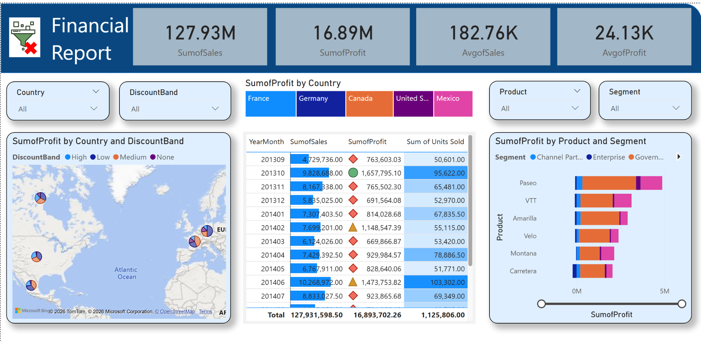

# Financial Performance Dashboard (Power BI)

## Project Overview

Organizations often have access to sales data but struggle to turn it into **clear, actionable financial insight**.
Raw figures alone do not explain how profitability changes across markets, products, or time.

This project delivers a **financial performance dashboard** built with **Power BI**, focusing on sales, profit, discount impact, and time-based comparisons using well-defined DAX measures.

The goal is to support **fact-based decision making**, not just reporting.

---

## Business Context & Questions

The dashboard is designed to answer practical finance questions such as:

- How do sales and profit differ across countries?
- Which products and segments contribute most to total profit?
- What is the financial impact of different discount bands?
- How does current performance compare with the same period last year?
- How do cumulative sales evolve throughout the year?

---

## Analytical Approach

The solution follows a structured analytics workflow:

1. **Data modeling** using a fact table and related dimension tables
2. **Base financial measures** (sales and profit aggregations)
3. **Filtered measures** for specific business conditions (year, discount band)
4. **Time intelligence measures** for:
   - Year-to-date (YTD) analysis
   - Same Period Last Year (SPLY) comparison
5. **Interactive visuals** that respond consistently to slicers and filters

All calculations are implemented using explicit DAX measures.

---

## Dashboard Preview



---

## Key KPIs

The report includes the following core metrics:

- Total Sales  
- Total Profit  
- Average Sales  
- Average Profit  
- Units Sold  

These KPIs provide a high-level financial snapshot and support deeper analysis.

---

## DAX Measures

All business logic is implemented using documented DAX measures, grouped into:

- Base aggregation measures  
- Business-condition filtered measures  
- Time intelligence measures (YTD and SPLY)

📄 Full measure documentation:  
`measures/all_measures.md`

> Note: This project includes **YTD** and **Same Period Last Year (SPLY)** comparisons.  


---

## Data

- **Source:** Case study dataset  
- **Format:** Excel  
- **Content:** Transaction-level sales data  
- **Main dimensions:** Date, Country, Product, Segment, Discount Band  

A short data dictionary is provided in the `data/` folder.

---

## Tools & Technologies

- Power BI Desktop  
- DAX  
- Data Modeling  
- Financial & Time-Based Analysis  

---

## How to Use

1. Download `dashboard/Financial_Report.pbix`
2. Open the file in **Power BI Desktop**
3. When prompted, update the data source path to:
   ```
   data/CaseStudy.xlsx
   ```
4. Explore the report using slicers and interactive visuals

---

## Repository Structure

```
dashboard/   → Power BI report and dashboard preview  
data/        → Dataset and data dictionary  
measures/    → DAX measures documentation  
docs/        → Business questions and context  
```

---

## Author

**Özge Güneş**  
Power BI • Data Analytics • Financial Analysis
